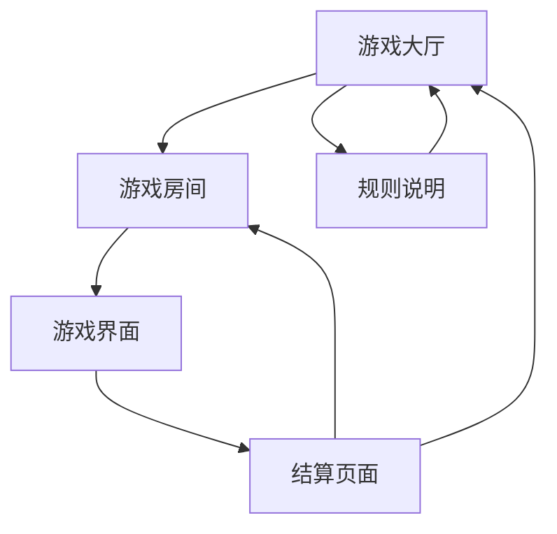

# 骆驼快跑线上游戏产品需求文档

## 1. 产品概述

基于经典桌游《骆驼快跑》(Camel Up)的线上多人游戏版本，支持3-8名玩家同时在线游玩。
- 完整还原桌游的核心玩法：赛驼比赛、投注系统、叠骆驼机制和赛道干预功能。
- 目标用户为桌游爱好者和休闲游戏玩家，提供便捷的线上聚会游戏体验。

## 2. 核心功能

### 2.1 用户角色

| 角色 | 注册方式 | 核心权限 |
|------|----------|----------|
| 游戏玩家 | 快速加入或昵称注册 | 可创建/加入房间、进行游戏、查看统计 |
| 房主 | 创建房间时自动获得 | 可开始游戏、踢出玩家、调整房间设置 |

### 2.2 功能模块

我们的骆驼快跑游戏需求包含以下主要页面：
1. **游戏大厅**：房间列表、创建房间、快速匹配、游戏规则
2. **游戏房间**：玩家列表、聊天功能、房间设置、准备状态
3. **游戏界面**：赛道显示、骆驼状态、投注面板、行动选择
4. **结算页面**：单轮结算、最终结算、积分统计、再来一局

### 2.3 页面详情

| 页面名称 | 模块名称 | 功能描述 |
|----------|----------|----------|
| 游戏大厅 | 房间列表 | 显示当前可加入的房间，包含房间名、人数、状态 |
| 游戏大厅 | 创建房间 | 设置房间名称、密码、最大人数，创建新房间 |
| 游戏大厅 | 快速匹配 | 自动匹配合适的房间或创建新房间 |
| 游戏大厅 | 游戏规则 | 详细的游戏规则说明和操作指南 |
| 游戏房间 | 玩家列表 | 显示房间内所有玩家、准备状态、房主标识 |
| 游戏房间 | 聊天系统 | 房间内文字聊天、表情包、快捷语句 |
| 游戏房间 | 房间设置 | 房主可调整游戏设置、踢出玩家 |
| 游戏界面 | 赛道显示 | 16格赛道、5只不同颜色骆驼、叠骆驼效果 |
| 游戏界面 | 投注面板 | 单轮投注卡、整场投注区、当前赔率显示 |
| 游戏界面 | 行动选择 | 投注、摇骰子、放置赛道板块三种行动 |
| 游戏界面 | 游戏状态 | 当前轮次、行动玩家、剩余骰子、金币数量 |
| 游戏界面 | 骰子系统 | 随机骰子摇取、骆驼移动动画、叠骆驼逻辑 |
| 游戏界面 | 赛道干预 | 加速/减速板块放置、移除机制 |
| 结算页面 | 单轮结算 | 显示本轮领先骆驼、投注收益、排行榜 |
| 结算页面 | 最终结算 | 最终排名、总收益计算、胜负统计 |
| 结算页面 | 游戏统计 | 个人战绩、历史记录、成就系统 |

## 3. 核心流程

主要游戏流程：
1. 玩家进入大厅，选择加入房间或创建新房间
2. 在房间内等待其他玩家加入，房主开始游戏
3. 游戏开始，玩家轮流选择行动：投注、摇骰子或放置赛道板块
4. 当5只骆驼都移动过后，进行单轮结算
5. 重复多轮，直到有骆驼到达终点，进行最终结算
6. 显示游戏结果，玩家可选择再来一局或返回大厅

## 4. 用户界面设计

### 4.1 设计风格

- **主色调**：沙漠金色 (#D4A574) 作为主色，深棕色 (#8B4513) 作为辅助色
- **按钮样式**：圆角矩形按钮，带有沙漠风格的纹理效果
- **字体**：主标题使用 28px 粗体，正文使用 16px 常规字体，选择易读的无衬线字体
- **布局风格**：卡片式布局，沙漠主题背景，骆驼和绿洲装饰元素
- **图标风格**：卡通风格的骆驼图标，沙漠主题的UI元素

### 4.2 页面设计概览

| 页面名称 | 模块名称 | UI元素 |
|----------|----------|--------|
| 游戏大厅 | 主界面 | 沙漠背景、骆驼剪影、金色按钮、房间卡片列表 |
| 游戏房间 | 等待界面 | 圆桌布局、玩家头像、聊天气泡、准备按钮 |
| 游戏界面 | 赛道区域 | 16格沙漠赛道、彩色骆驼模型、叠加效果 |
| 游戏界面 | 投注区域 | 投注卡片、金币图标、赔率数字、确认按钮 |
| 游戏界面 | 控制面板 | 行动按钮组、骰子动画、计时器、状态指示 |
| 结算页面 | 结果展示 | 排行榜样式、金币动画、庆祝效果、统计图表 |

### 4.3 响应式设计

桌面优先设计，支持平板和手机端适配。赛道在小屏幕上垂直显示，投注面板采用滑动抽屉设计，确保触摸操作友好。