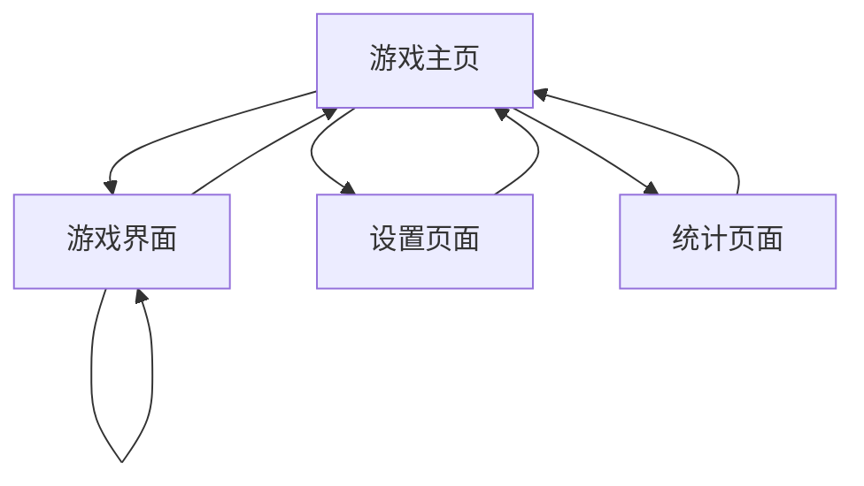

# 黑白棋游戏产品需求文档

## 1. 产品概述

基于minimax算法的黑白棋（Reversi/Othello）游戏，提供人机对战功能，玩家可以与智能AI进行对弈。
- 游戏采用经典的8x8棋盘，实现标准黑白棋规则，AI使用minimax算法提供有挑战性的对手。
- 目标用户为喜欢策略游戏的玩家，通过智能AI提升游戏体验和挑战性。

## 2. 核心功能

### 2.1 用户角色

| 角色 | 注册方式 | 核心权限 |
|------|----------|----------|
| 默认用户 | 无需注册，直接游戏 | 可进行游戏、查看统计、调整设置 |

### 2.2 功能模块

我们的黑白棋游戏需求包含以下主要页面：
1. **游戏主页**：游戏标题、开始游戏按钮、游戏设置、游戏统计
2. **游戏界面**：8x8棋盘、当前玩家提示、棋子计数、游戏控制按钮
3. **设置页面**：AI难度选择、游戏规则说明、音效开关
4. **统计页面**：胜负记录、游戏历史、最佳成绩

### 2.3 页面详情

| 页面名称 | 模块名称 | 功能描述 |
|----------|----------|----------|
| 游戏主页 | 标题区域 | 显示游戏名称和欢迎信息 |
| 游戏主页 | 开始游戏 | 点击开始新游戏，进入游戏界面 |
| 游戏主页 | 快速设置 | 选择AI难度（简单/中等/困难），选择先手方 |
| 游戏主页 | 统计预览 | 显示总游戏次数、胜率等基本统计 |
| 游戏界面 | 游戏棋盘 | 8x8网格棋盘，显示黑白棋子，高亮可落子位置 |
| 游戏界面 | 状态显示 | 显示当前轮到哪方、黑白棋子数量、剩余可落子数 |
| 游戏界面 | 游戏控制 | 悔棋、重新开始、返回主页、暂停游戏 |
| 游戏界面 | AI思考提示 | AI思考时显示加载动画和思考时间 |
| 设置页面 | AI难度设置 | 选择AI算法深度（3-7层），影响AI强度 |
| 设置页面 | 游戏选项 | 音效开关、动画速度、棋盘主题选择 |
| 设置页面 | 规则说明 | 详细的黑白棋游戏规则和操作说明 |
| 统计页面 | 游戏记录 | 显示最近10局游戏结果和用时 |
| 统计页面 | 统计数据 | 总局数、胜负平次数、胜率、平均用时 |
| 统计页面 | 成就系统 | 连胜记录、完美游戏、快速胜利等成就 |

## 3. 核心流程

主要用户操作流程：
1. 用户进入游戏主页，可以查看统计信息或调整设置
2. 点击开始游戏，选择难度和先手方，进入游戏界面
3. 在游戏界面中，玩家和AI轮流落子，系统实时更新棋盘状态
4. 游戏结束后显示结果，可选择再来一局或返回主页
5. 用户可随时进入设置页面调整游戏参数，或查看统计页面了解游戏历史

## 4. 用户界面设计

### 4.1 设计风格

- **主色调**：深绿色 (#2E7D32) 作为主色，浅绿色 (#81C784) 作为辅助色
- **按钮样式**：圆角矩形按钮，带有轻微阴影效果
- **字体**：主标题使用 24px 粗体，正文使用 16px 常规字体，系统默认无衬线字体
- **布局风格**：卡片式布局，居中对齐，响应式设计
- **图标风格**：使用简洁的线性图标，黑白棋子使用经典的圆形设计

### 4.2 页面设计概览

| 页面名称 | 模块名称 | UI元素 |
|----------|----------|--------|
| 游戏主页 | 标题区域 | 大号标题文字，居中显示，深绿色背景渐变 |
| 游戏主页 | 功能按钮 | 大型圆角按钮，绿色主题，图标+文字组合 |
| 游戏界面 | 游戏棋盘 | 8x8网格，绿色背景，黑白圆形棋子，可落子位置半透明提示 |
| 游戏界面 | 状态栏 | 顶部固定栏，显示当前状态，黑白棋子计数器 |
| 游戏界面 | 控制按钮 | 底部按钮组，小型圆角按钮，图标样式 |
| 设置页面 | 设置项 | 卡片式布局，每个设置项独立卡片，开关和滑块控件 |
| 统计页面 | 数据展示 | 数字突出显示，进度条和图表，卡片式信息组织 |

### 4.3 响应式设计

桌面优先设计，支持移动端适配，棋盘在小屏幕上自动缩放，触摸操作优化。